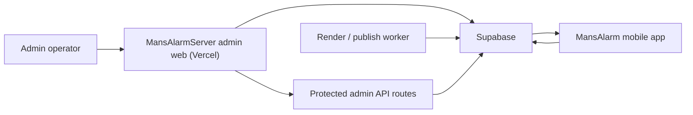

# MansAlarm Architecture Overview

## System shape

MansAlarm is split into two repositories:

- `MansAlarmServer`: admin web, Supabase schema, protected admin APIs, worker scaffold
- `MansAlarm`: Expo mobile app for Android and iOS

Supabase is the system of record.

## Data flow

### Content pipeline

1. Admin creates or edits a `daily_contents` row in `/content`
2. Admin uploads a vertical background asset to Supabase Storage
3. Admin triggers `Render preview`
4. A render job is inserted into `render_jobs`
5. The worker reads the job, burns in phrase text, and uploads:
   - preview MP4 to `shortform_video_url`
   - poster JPG to `poster_asset_path`
6. Admin approves the rendered asset
7. Admin publishes immediately or schedules publication
8. Publish jobs are inserted into `publish_jobs`

### Mobile consumption

The mobile app reads these public resources directly from Supabase with the anon key:

- `daily_contents`
- `product_categories`
- `products`

The mobile app writes limited public data:

- `signup_leads` insert only

Admin-only flows do **not** go through the mobile client. They run through:

- Vercel admin routes
- Supabase admin policies
- service-role-backed worker jobs

## Current implemented boundaries

### Implemented now

- `daily_contents` is the source for today's phrase content
- mobile reads `phrase`, `sub_phrase`, `description`, `shortform_video_url`, `poster_asset_path`, `reward_url`
- mobile snapshots phrase and media values into the alarm schedule
- render jobs and publish jobs are persisted in Supabase
- admin-only API routes exist for render, approve, publish, and retries

### Not fully complete yet

- YouTube upload connector
- Instagram Reels upload connector
- community tables and mobile community screens

## Mobile read model

The mobile app treats `daily_contents` as today's public read model.

Important rules:

- typing validation always uses `phrase`
- `sub_phrase` and `description` are display-only
- `shortform_video_url` is preferred for the home and mission background
- `poster_asset_path` is the fallback visual when video is absent or fails
- the alarm saves a local snapshot so already scheduled alarms do not break if today's row changes later
